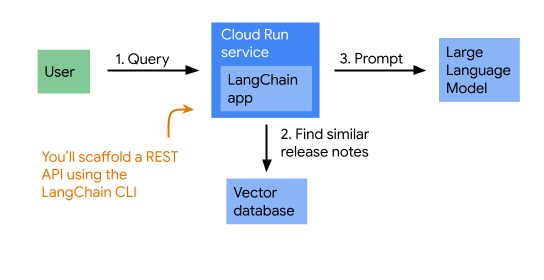

## OvervieW:
deploy a LangChain app that uses Gemini to let you ask questions over the Cloud Run

the app first retrieves Cloud Run release notes that are similar to the question, then prompts Gemini with both the question and the release notes

V

Install poetry
Install poetry for dependency management. It has a lockfile to keep your transitive dependencies in check.

pipx install poetry

Acknowledgements:
source: https://github.com/google/cloud-run-release-notes

